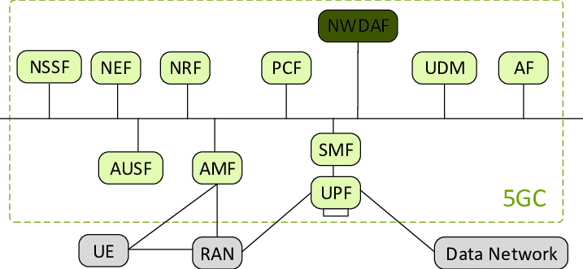
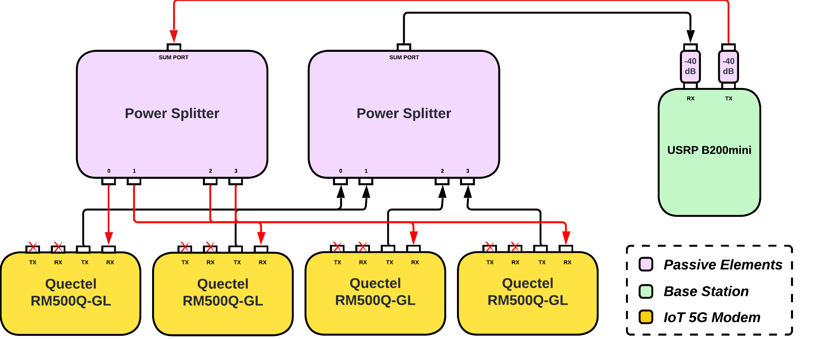
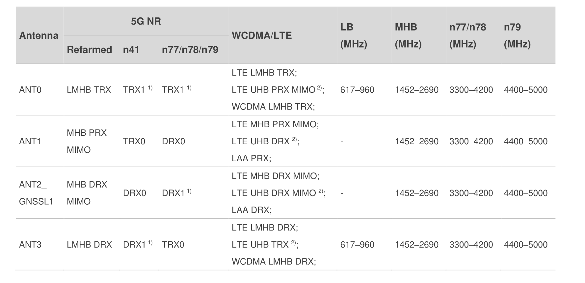
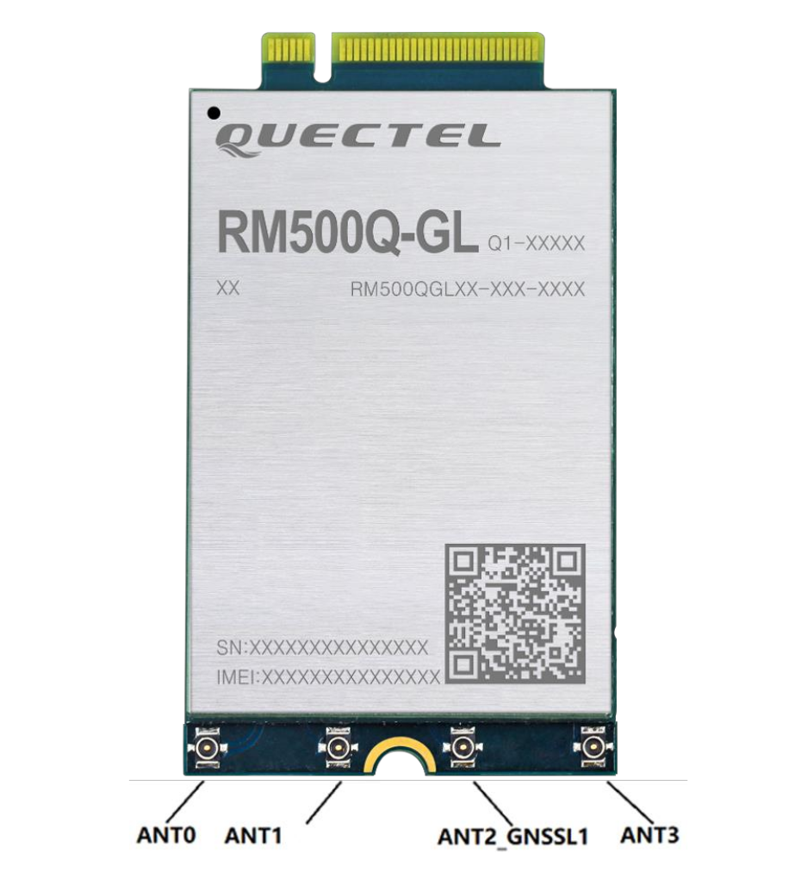

# 📡 5G-Network-OAI-Multi-COTS

This repository provides a complete guide to deploying a standalone 5G network using OpenAirInterface (OAI) with commercial off-the-shelf (COTS) hardware. It walks you through building a core network, configuring a base station (gNodeB), connecting real user equipment (UE), and integrating performance monitoring tools.
[](https://github.com/shariquetelco)


# 📡 5G-Network-OAI-Multi-COTS



[](https://www.docker.com/)
[](https://ubuntu.com/)
[](LICENSE)
[](https://openairinterface.org/)
[](https://github.com/shariquetelco)


---

## 📑 Table of Contents

* [📡 Project Overview](#-project-overview)
* [🏗️ Network Architecture](#️-network-architecture)
* [🛠️ Hardware Requirements](#️-hardware-requirements)
* [🚀 Installation Guide](#-installation-guide)
* [🏙️ OAI Core Network Setup](#️-oai-core-network-setup)
* [🚜 gNodeB Installation](#-gnodeb-installation)
* [⚙️ Network Config Parameters](#️-network-config-parameters)
* [🔧 SIM Configuration](#-sim-configuration-optional)
* [📂 Database Configuration](#-database-configuration)
* [💻 Running the Network](#-running-the-network)
* [📱 UE Configuration (AT Commands)](#-ue-configuration-at-commands)
* [🔧 Modem Integration (NetworkManager)](#-modem-integration-networkmanager)
* [📊 Monitoring & Logs](#-monitoring--logs)
* [😧 Troubleshooting](#-troubleshooting)
* [📊 Performance Benchmarks](#-performance-benchmarks)
* [📚 References](#-references)
* [📄 License](#-license)

---

## 🛍️ Project Overview

This repository provides a complete guide to deploying a standalone 5G network using OpenAirInterface (OAI) with commercial off-the-shelf (COTS) hardware. It walks you through building a core network, configuring a base station (gNodeB), connecting real user equipment (UE), and integrating performance monitoring tools.

This implementation showcases an end-to-end 5G SA network stack:

* Core Network: OAI CN5G
* gNodeB: Built using OpenAirInterface RAN
* UE: Quectel RM500Q-GL module or simulated UE
* SDR: USRP B200mini/B210 for RF


---

## 🛍️ Project Overview

This implementation showcases an end-to-end 5G SA network stack:

* Core Network: OAI CN5G
* gNodeB: Built using OpenAirInterface RAN
* UE: Quectel RM500Q-GL module or simulated UE
* SDR: USRP B200mini/B210 for RF

---

## 🏗️ Network Architecture


### ⚙️ Core Components

* **AMF**: Registration, connection, mobility management
* **SMF**: PDU session management
* **UPF**: User-plane data forwarding
* **NRF**: Service discovery and registration
* **UDM**: Subscription management
* **UDR**: Stores subscriber data
* **AUSF**: Handles UE authentication

### 📶 RAN Components

* **gNodeB (gNB)**: 5G base station
* **SDR Platform**: USRP B200mini/B210
* **UE**: Quectel RM500Q-GL via USB or embedded boards


---

## 🛠️ Hardware Requirements

### SDR

* **Model**: USRP B200mini/B210
* **Range**: 70 MHz - 6 GHz
* **Bandwidth**: Up to 61.44 MS/s

### UE

* **Module**: Quectel RM500Q-GL
* **Interface**: USB-C, 5G-M2 EVB
* **Standards**: 5G NR Sub-6GHz, LTE





---

## 🚀 Installation Guide

### ✅ Prerequisites

* Ubuntu 20.04/22.04
* 8 GB RAM, 50 GB disk, Docker support
* USB 3.0 for SDR

### ① Install System Dependencies

```bash
sudo apt update && sudo apt upgrade -y
sudo apt install -y git net-tools putty curl software-properties-common
```

### ② Install Docker & Compose

```bash
curl -fsSL https://download.docker.com/linux/ubuntu/gpg | sudo apt-key add -
sudo add-apt-repository "deb [arch=amd64] https://download.docker.com/linux/ubuntu $(lsb_release -cs) stable"
sudo apt update
sudo apt install -y docker docker-ce
sudo usermod -a -G docker $(whoami)
newgrp docker
```

### ③ Install UHD Drivers

```bash
sudo apt install -y libboost-all-dev libusb-1.0-0-dev doxygen python3-* \
    cmake build-essential

# Build UHD
git clone https://github.com/EttusResearch/uhd.git ~/uhd
cd ~/uhd && git checkout v4.3.0.0
cd host && mkdir build && cd build
cmake ../ && make -j $(nproc) && sudo make install && sudo ldconfig
sudo uhd_images_downloader
```

---

## 🏙️ OAI Core Network Setup

### ① Clone Core

```bash
git clone https://gitlab.eurecom.fr/oai/cn5g/oai-cn5g-fed.git ~/oai-cn5g-fed
```

### ② Pull Docker Images

```bash
docker pull oaisoftwarealliance/oai-amf:develop
... (pull all CN components) ...
```

### ③ Tag Docker Images

```bash
docker image tag oaisoftwarealliance/oai-amf:develop oai-amf:develop
```

### ④ Download Configs

```bash
wget -O docker-compose-basic-nrf.yaml <URL>
wget -O oai_db.sql <URL>
```

---

## 🚜 gNodeB Installation

```bash
git clone https://gitlab.eurecom.fr/oai/openairinterface5g.git ~/openairinterface5g
cd ~/openairinterface5g
source oaienv && cd cmake_targets && ./build_oai -I
./build_oai -w USRP --ninja --nrUE --gNB --build-lib all -c
```

---

## ⚙️ Network Config Parameters

```yaml
MCC: 208
MNC: 92
PLMN: 20892
TAC: 0x0001
```

---

## 🔧 SIM Configuration (Optional)

```bash
sudo ./program_uicc --adm 12345678 --imsi 001010000000001 --isdn 00000001 \
  --key fec86b... --opc C4244... --spn "OpenAirInterface"
```

---

## 📂 Database Configuration

```sql
USE oai_db;
INSERT INTO AuthenticationSubscription (...) VALUES (...);
INSERT INTO SessionManagementSubscriptionData (...) VALUES (...);
```

---

## 💻 Running the Network

### Core Network

```bash
cd ~/oai-cn5g-fed/docker-compose
python3 core-network.py --type start-basic --scenario 1
```

### gNodeB

```bash
cd ~/openairinterface5g && source oaienv
cd cmake_targets/ran_build/build
sudo ./nr-softmodem -O <gnb.conf> --sa -E --continuous-tx
```




---

## 📱 UE Configuration (AT Commands)

```bash
AT+QMBNCFG="Select","ROW_Commercial"
AT+CGDCONT=1,"IP","oai"
AT+CGPADDR=1
AT+QPING=1,"openairinterface.org"
```

---

## 🔧 Modem Integration (NetworkManager)

Create `quectel-oai-ppp.nmconnection` under `/etc/NetworkManager/system-connections/`

```ini
[connection]
id=quectel-oai-ppp
type=gsm

[gsm]
apn=oai
device=/dev/ttyUSB0

[ipv4]
method=auto
```

```bash
sudo chmod 600 ... && sudo systemctl reload NetworkManager
nmcli con up quectel-oai-ppp
```

---

## 📊 Monitoring & Logs

### Core Logs

```bash
docker ps
docker logs oai-amf
tcpdump -i any host 192.168.70.131
```

### gNB

```bash
tail -f /var/log/oai/gnb.log
uhd_find_devices
```

### UE

```bash
AT+CSQ
AT+CEREG?
AT+CGATT?
```

---

## 😧 Troubleshooting

| Issue                | Fix                                  |
| -------------------- | ------------------------------------ |
| Docker permission    | `sudo usermod -a -G docker $USER`    |
| UHD device not found | `uhd_images_downloader`              |
| RF not detected      | `lsusb`, `dmesg`, `uhd_find_devices` |
| SIM not recognized   | `AT+CPIN?`, `AT+CEREG?`              |

---

## 📊 Performance Benchmarks

| Metric            | Expected    |
| ----------------- | ----------- |
| Throughput        | 50-100 Mbps |
| Latency           | 5-15 ms     |
| Registration Time | 2-5 seconds |

---

## 📚 References

* OpenAirInterface Documentation
* Ettus UHD Manual
* Quectel 5G Module AT Guide

---

## 📄 License

This project is licensed under the MIT License. See [LICENSE](LICENSE) for more info.

---

🚀 *Built for academic research, testing, and R\&D environments.*
